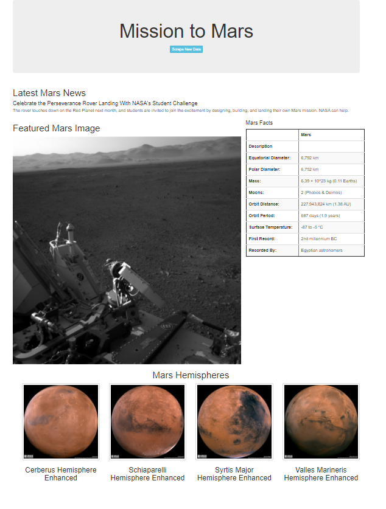

# Mission-to-Mars
# Web Scraping Mars Data and Displaying with Flask

Using the Beautiful Soup Library to parsing the HTML of various NASA and space facts websites, we are scraping Mars data and displaying it in a Flask Python web app. To contain the data we are scraping, we are using a non-relative database MongoDB

### Figure 1 - Image of the resulting Flask page with scraped data
</img>

Some Bootstrap additions were:

- Changing the color and size of the button
- Have Mars Hemispheres in a single row and displayed as thumbnails
